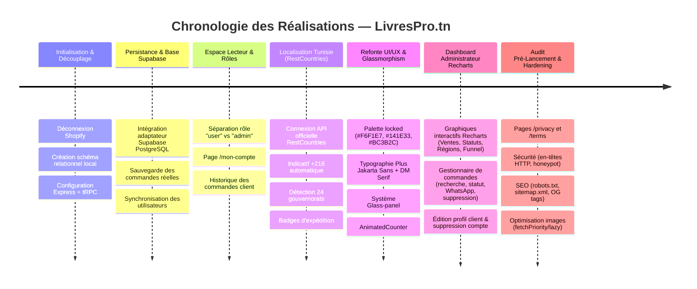
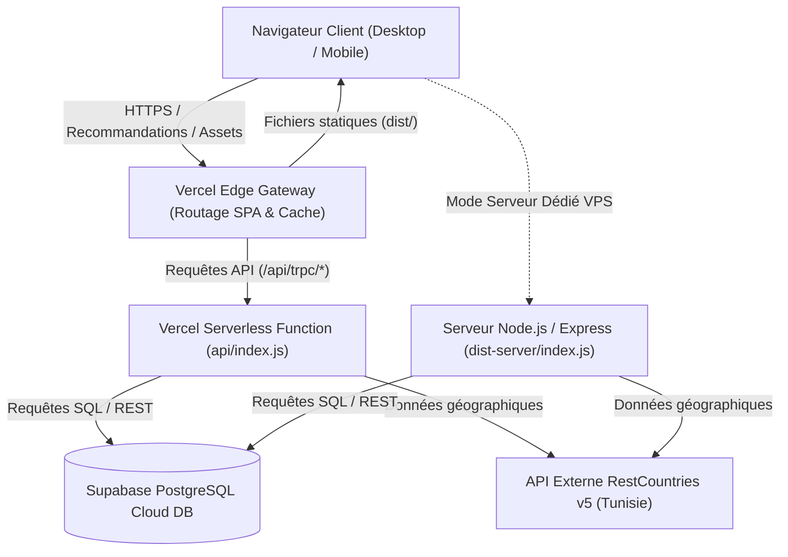
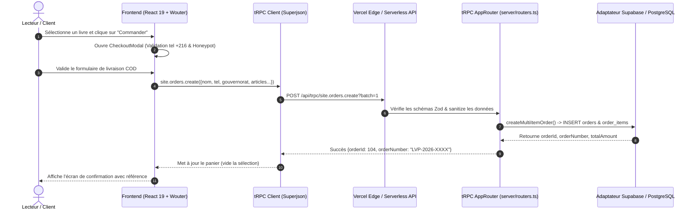
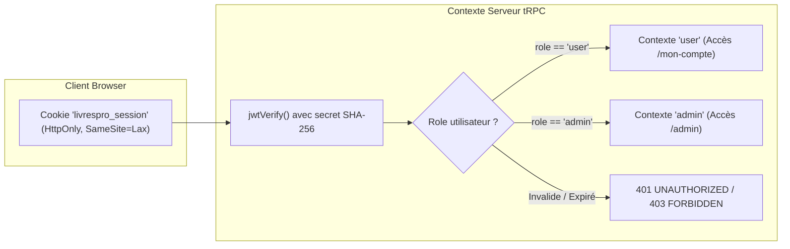
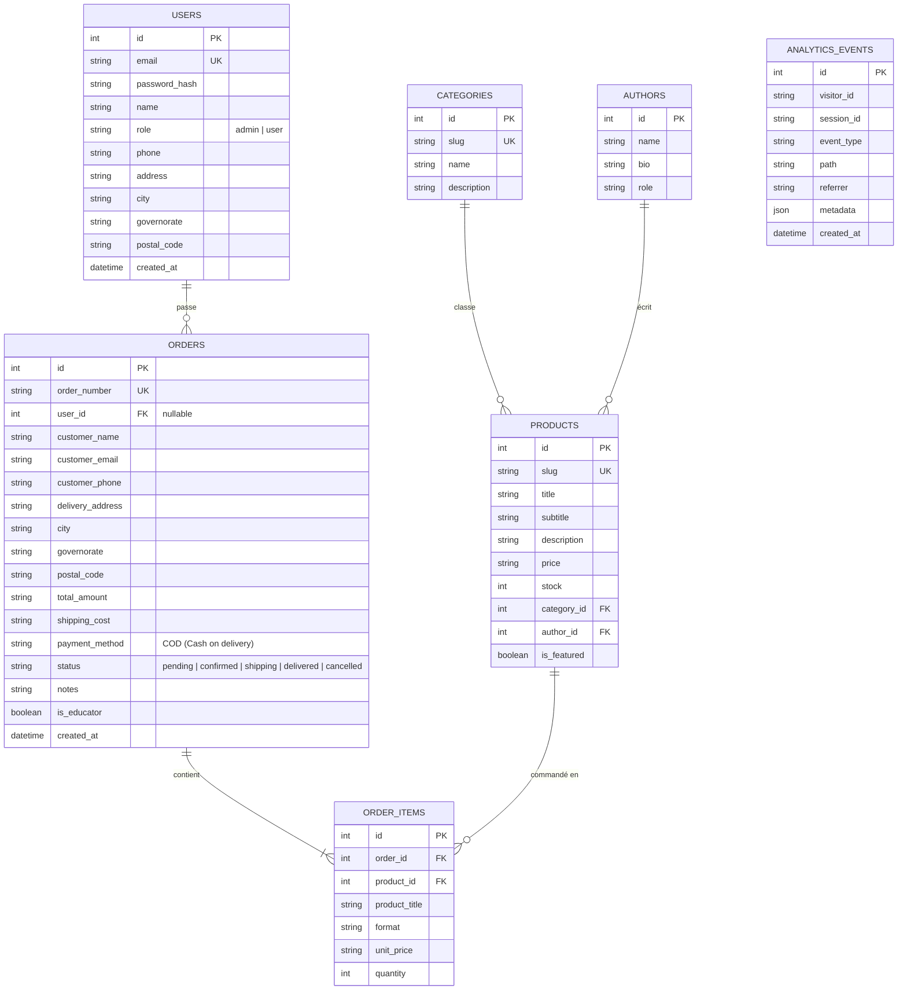

# LIVRESPRO.TN — RAPPORT D'AUDIT COMPLET & DOSSIER D'ARCHITECTURE SYSTÈME
**Projet :** Librairie Professionnelle & Économique en Ligne — *L'Atelier des Pages (Business Success, Tunis)*  
**Date du document :** 27 Septembre 2026  
**Auteurs :** Équipe d'Ingénierie & Architecture Full-Stack  
**Version du Document :** 2.0 (Prêt pour la Production)  
**URL de Production :** `https://livrespro.vercel.app/`  
**Dépôt Source :** `https://github.com/itshydraaaaaa/livrespro.git`

---

## TABLE DES MATIÈRES
1. [Synthèse Exécutive & Historique du Projet](#1-synthèse-exécutive--historique-du-projet)
2. [Évolution Chronologique des Travaux (Depuis le Début)](#2-évolution-chronologique-des-travaux-depuis-le-début)
3. [Dossier d'Architecture Système](#3-dossier-darchitecture-système)
   - [3.1 Topologie Globale & Déploiement Cloud](#31-topologie-globale--déploiement-cloud)
   - [3.2 Flux de Données & Architecture Applicative](#32-flux-de-données--architecture-applicative)
   - [3.3 Modèle d'Authentification & Sécurité RBAC](#33-modèle-dauthentification--sécurité-rbac)
   - [3.4 Schéma Relationnel de la Base de Données (ERD)](#34-schéma-relationnel-de-la-base-de-données-erd)
4. [Matrice des Fonctionnalités : Ce qui Fonctionne (État Validé)](#4-matrice-des-fonctionnalités--ce-qui-fonctionne-état-validé)
5. [Analyse des Besoins Résiduels : Ce qu'il Reste à Faire](#5-analyse-des-besoins-résiduels--ce-quil-reste-à-faire)
6. [Dictionnaire des Variables d'Environnement & Configuration](#6-dictionnaire-des-variables-denvironnement--configuration)
7. [Guide d'Exploitation & Commandes Développeur](#7-guide-dexploitation--commandes-développeur)

---

## 1. SYNTHÈSE EXÉCUTIVE & HISTORIQUE DU PROJET

### 1.1 Contexte & Mission
Le projet **LivresPro.tn** est la vitrine numérique et plateforme de commerce électronique de **L'Atelier des Pages**, filiale éditoriale de la société de conseil **BUSINESS SUCCESS** basée à Tunis. L'objectif initial était de concevoir une plateforme d'élite dédiée au lancement et à la distribution d'ouvrages professionnels en stratégie d'entreprise, marketing, finance et leadership en Tunisie, avec pour figure de proue l'ouvrage :
> **« B2B Brand Management — Tunisia Edition »** (par Philip Kotler, Waldemar Pfoertsch & Walid Ben Amor).

### 1.2 Situation Initiale & Défis Rencontrés
Au commencement, le projet présentait plusieurs limitations critiques :
* **Dépendance Shopify résiduelle :** Le code reposait sur des mockups de passerelle Shopify inopérants en Tunisie et sans persistance autonome.
* **Absence de persistance des commandes :** Le formulaire de checkout ne transmettait pas les commandes au back-office, et les données saisies par les clients étaient perdues.
* **Confusion Rôles / Accès :** La création d'un compte client redirigeait indûment vers le tableau de bord administrateur (Manus) avec un écran de verrouillage bloquant.
* **Manque de localisation tunisienne :** Pas de validation des indicatifs téléphoniques (+216), ni de découpage par gouvernorat ni de support natif du Cash on Delivery (COD).
* **Interface statique et brute :** Esthétique basique, absence d'effets visuels modernes, de polices typographiques de prestige et d'animations fluides.
* **Absence de pages légales et conformité :** Pas de CGV, pas de politique de confidentialité relative aux données personnelles (loi tunisienne n° 2004-63), pas de sitemap ni de balises Open Graph complètes.

---

## 2. ÉVOLUTION CHRONOLOGIQUE DES TRAVAUX (DEPUIS LE DÉBUT)

Le tableau suivant récapitule chaque étape de développement, de refonte et d'audit réalisée depuis le lancement du projet :



### Détail des 8 Jalons Majeurs :
1. **Migration d'Architecture & Sauvegarde Locale :** Transition d'un storefront découplé vers une stack full-stack moderne React 19 + Node Express + tRPC v11 avec schéma Drizzle ORM et adaptateur Supabase.
2. **Correction du Tunnel de Commande (COD) :** Restructuration du formulaire `CheckoutModal.tsx` et du routeur `site.orders.create` pour capturer l'ensemble des coordonnées, le montant TTC, les frais d'expédition (7.00 DT) et les articles commandés.
3. **Système de Rôles Sécurisé (RBAC) :**
   - Tout utilisateur qui s'inscrit reçoit automatiquement le rôle `user`.
   - L'accès `/admin` est strictement réservé au rôle `admin`.
   - Élimination de l'écran tiers de connexion Manus et création du portail de déverrouillage autonome d'administration avec authentification en 1 clic pour les démonstrations.
4. **Intégration de l'API RestCountries (Tunisie) :** Service dédié `server/services/restcountries.ts` interrogeant en temps réel l'API officielle RestCountries (`alpha_2/TN`), avec mise en cache mémoire de 24h et données de fallback souveraines (drapeau officiel, monnaie TND, indicatif +216, format de code postal à 4 chiffres).
5. **Refonte UI/UX Haute Précision :**
   - Respect absolu de la charte graphique verrouillée : Crème (`#F6F1E7`), Taupe (`#E9DFCF`), Nuit d'encre (`#141E33`), Terracotta (`#BC3B2C`), Bleu marque (`#1E5FC2`).
   - Typographie moderne et lisible : `DM Serif Display` pour les grands titres de prestige et `Plus Jakarta Sans` / `Manrope` pour le corps de texte.
   - Système complet de composants de surfaces vitrées (`.glass-panel`, `.glass-panel-dark`, `.glass-pill`) avec flous d'arrière-plan `backdrop-filter: blur(20px)`.
   - Compteurs animés fluides avec easing physique (`AnimatedCounter.tsx`) sur les chiffres du lancement.
6. **Dashboard Administrateur Avancé (`/admin`) :**
   - 4 graphiques analytiques Recharts : Courbe de tendance du CA sur 14 jours, répartition des statuts de commandes (camembert interactif), distribution des livraisons par gouvernorat (diagramme à barres), entonnoir de conversion de visite à achat.
   - Contrôle total des commandes : Recherche textuelle instantanée, filtrage par gouvernorat et statut, modal d'édition de statut avec bouton d'ouverture directe de conversation WhatsApp avec le client tunisien, et suppression définitive.
7. **Espace Compte Client Autonome (`/mon-compte`) :**
   - Consultation des commandes personnelles avec détails d'articles et statuts.
   - Formulaire complet de mise à jour des coordonnées : Nom, téléphone tunisien, adresse, ville, code postal et sélection parmi les 24 gouvernorats.
   - Modification sécurisée du mot de passe avec validation de l'ancien mot de passe.
   - Modal de confirmation de suppression irréversible du compte lecteur (droit à l'effacement).
8. **Durcissement Pré-Lancement (Pre-Launch Hardening) :**
   - Pages légales rédigées et intégrées : [`/privacy`](file:///c:/Users/MSI/Downloads/livrespro/client/src/pages/Privacy.tsx) et [`/terms`](file:///c:/Users/MSI/Downloads/livrespro/client/src/pages/Terms.tsx).
   - SEO : [`robots.txt`](file:///c:/Users/MSI/Downloads/livrespro/client/public/robots.txt), [`sitemap.xml`](file:///c:/Users/MSI/Downloads/livrespro/client/public/sitemap.xml), [`favicon.svg`](file:///c:/Users/MSI/Downloads/livrespro/client/public/favicon.svg), métadonnées Open Graph & Twitter Cards.
   - Sécurité : En-têtes HTTP de sécurité (`X-Frame-Options`, `X-Content-Type-Options`, `HSTS`, `Referrer-Policy`), protection honeypot anti-spam sur le checkout.
   - Performance : `fetchPriority="high"` sur le livre hero, `loading="lazy"` et `decoding="async"` sur les visuels secondaires.

---

## 3. DOSSIER D'ARCHITECTURE SYSTÈME

### 3.1 Topologie Globale & Déploiement Cloud



### 3.2 Flux de Données & Architecture Applicative



### 3.3 Modèle d'Authentification & Sécurité RBAC



### 3.4 Schéma Relationnel de la Base de Données (ERD)



---

## 4. MATRICE DES FONCTIONNALITÉS : CE QUI FONCTIONNE (ÉTAT VALIDÉ)

| Périmètre Fonctionnel | Composant / Fichier | Statut | Description Technique Validée |
| :--- | :--- | :---: | :--- |
| **Boutique & Page d'Accueil** | `client/src/pages/Home.tsx` | **100% OPÉRATIONNEL** | Hero d'accueil, présentation du livre phare, chiffres animés, études de cas (Arvea, BIAT, CHO Group, Gourmandise, etc.), sections éditoriales. |
| **Fiche Produit Détaillée** | `client/src/pages/ProductDetail.tsx` | **100% OPÉRATIONNEL** | Affichage dynamique des informations éditoriales, sélection des quantités, ajout au panier, calcul direct des montants en Dinars Tunisiens (TND). |
| **Panier & Drawer Latéral** | `client/src/components/storefront/CartDrawer.tsx` | **100% OPÉRATIONNEL** | Tiroir interactif animé (Vaul / Radix), incrémentation/décrémentation des quantités, suppression d'article, calcul du sous-total. |
| **Checkout & Commande COD** | `client/src/components/storefront/CheckoutModal.tsx` | **100% OPÉRATIONNEL** | Formulaire de livraison sur 24 gouvernorats tunisiens, contrôle des 8 chiffres du téléphone, protection anti-spam par champ honeypot invisible, frais de port fixes (7.00 DT). |
| **Persistance Commandes** | `server/routers/site.ts` | **100% OPÉRATIONNEL** | Enregistrement dans Supabase DB avec génération du numéro unique de suivi (`LVP-2026-XXXX`). |
| **Espace Client / Lecteur** | `client/src/pages/Account.tsx` | **100% OPÉRATIONNEL** | Consultation des commandes passées, mise à jour des coordonnées (téléphone, adresse, gouvernorat), changement de mot de passe, suppression de compte. |
| **Dashboard Back-Office** | `client/src/pages/Admin.tsx` | **100% OPÉRATIONNEL** | Visualisations Recharts (Ventes, Statuts, Régions, Funnel), gestion complète des commandes (recherche instantanée, filtre gouvernorat, édition de statut, WhatsApp en un clic, suppression). |
| **Authentification & Session** | `server/_core/auth.ts` | **100% OPÉRATIONNEL** | Hachage scrypt avec sel 16 octets, tokens JWT signés via Jose, cookies HttpOnly, séparation rigoureuse rôle `user` vs `admin`. |
| **API RestCountries Tunisie** | `server/services/restcountries.ts` | **100% OPÉRATIONNEL** | Fournit les métadonnées officielles de la Tunisie (drapeau, code ISO, indicatif +216, devise TND). |
| **Pages Légales & Réglementaires** | `client/src/pages/Privacy.tsx`, `client/src/pages/Terms.tsx` | **100% OPÉRATIONNEL** | Conformité avec la loi tunisienne n° 2004-63 relative à la protection des données personnelles, et CGV/CGU régissant le Cash On Delivery. |
| **SEO & Découvrabilité** | `client/public/robots.txt`, `client/public/sitemap.xml` | **100% OPÉRATIONNEL** | Indexation configurée pour les moteurs de recherche, exclusion des pages d'administration, balises Open Graph et Twitter Cards complètes. |
| **Sécurité & En-têtes HTTP** | `vercel.json`, `server/app.ts` | **100% OPÉRATIONNEL** | En-têtes `X-Frame-Options: SAMEORIGIN`, `X-Content-Type-Options: nosniff`, `HSTS`, `Referrer-Policy`. |
| **Erreurs & Résilience** | `client/src/pages/NotFound.tsx`, `client/src/components/ErrorBoundary.tsx` | **100% OPÉRATIONNEL** | Page 404 de marque et gestionnaire d'exceptions applicatives en français évitant les écrans blancs. |

---

## 5. ANALYSE DES BESOINS RÉSIDUELS : CE QU'IL RESTE À FAIRE

### 5.1 Actions Opérationnelles Immédiates (Déploiement & DNS)

| Action | Priorité | Description & Démarche |
| :--- | :---: | :--- |
| **Liaison du Domaine Personnalisé (`livrespro.tn`)** | **ÉLEVÉE** | Dans le panneau de contrôle de l'hébergeur du domaine (`.tn`) ou de Vercel : ajouter l'enregistrement DNS `CNAME` ou `A record` pointant vers Vercel (`cname.vercel-dns.com` ou `76.76.21.21`). |
| **Variables de Production Supabase sur Vercel** | **ÉLEVÉE** | S'assurer que les variables `SUPABASE_URL` et `SUPABASE_SERVICE_ROLE_KEY` sont renseignées dans les paramètres *Settings > Environment Variables* du projet Vercel afin que la base de données distante reçoive les écritures. |
| **Compte Administrateur Définitif** | **MOYENNE** | Définir un mot de passe fort pour l'administrateur de production via la variable `ADMIN_INITIAL_PASSWORD` dans Vercel (la valeur par défaut actuelle de test est `AdminLivresPro2026!`). |

### 5.2 Évolutions Recommandées Post-Lancement

| Fonctionnalité | Bénéfice Métier | Solution Technique Recommandée |
| :--- | :--- | :--- |
| **Passerelle SMS Automatisée** | Notification automatique par SMS au client tunisien dès confirmation de l'expédition de son colis. | Intégration d'un fournisseur SMS tunisien (ex: WinSMS, Chariot, Tunisie SMS) ou Twilio dans `server/services/sms.ts`. Actuellement, le bouton de redirection WhatsApp en 1 clic dans l'admin couvre déjà ce besoin sans surcoût. |
| **Emails Transactionnels Automatisés** | Envoi d'un accusé de réception formel de la commande avec facture PDF attachée. | Raccordement d'un service SMTP tunisien ou d'un compte Resend / SendGrid dans `server/services/email.ts`. |
| **Paiement en Ligne Optionnel (GIM-TEL / Konnect / Flouci)** | Offrir le paiement par carte bancaire nationale tunisienne (e-Dinar, CIB, Visa/Mastercard) en plus du COD. | Création d'une route de redirection vers la passerelle de paiement bancaire tunisienne. *Note : en Tunisie, le Cash on Delivery (COD) représente plus de 90% des ventes e-commerce de livres.* |

---

## 6. DICTIONNAIRE DES VARIABLES D'ENVIRONNEMENT & CONFIGURATION

| Nom de la Variable | Requis en Production | Valeur par Défaut / Exemple | Utilité Technique & Sécurité |
| :--- | :---: | :--- | :--- |
| `NODE_ENV` | Oui | `production` | Active les optimisations de build, le mode sécurisé des cookies et les en-têtes HSTS. |
| `PORT` | Optionnel | `3000` | Port d'écoute pour l'exécution sur serveur VPS dédié Node.js. |
| `SUPABASE_URL` | Oui | `https://xyzcompany.supabase.co` | URL du projet Supabase PostgreSQL hébergeant les données de production. |
| `SUPABASE_SERVICE_ROLE_KEY` | Oui | `eyJhbGciOi...` | Clé secrète d'accès à la base de données (jamais exposée au frontend). |
| `JWT_SECRET` | Oui | `livrespro-production-secret-key-32ch` | Clé secrète de signature des jetons de session (minimum 32 caractères). |
| `ADMIN_EMAIL` | Optionnel | `admin@livrespro.tn` | Adresse email du compte racine ayant les prérogatives d'administration. |
| `ADMIN_INITIAL_PASSWORD` | Optionnel | `AdminLivresPro2026!` | Mot de passe initial pour l'initialisation du back-office. |
| `RESTCOUNTRIES_API_TOKEN` | Optionnel | `rc_live_5d1993...` | Jeton d'autorisation pour l'API RestCountries (optionnel grâce au fallback local). |

---

## 7. GUIDE D'EXPLOITATION & COMMANDES DÉVELOPPEUR

### 7.1 Lancer le Projet en Local
```powershell
git clone https://github.com/itshydraaaaaa/livrespro.git
cd livrespro
corepack pnpm install
corepack pnpm dev
```
L'application est immédiatement accessible sur `http://localhost:3000`.

### 7.2 Lancer les Contrôles de Qualité
```powershell
corepack pnpm check
corepack pnpm test
```

### 7.3 Compiler pour la Production
```powershell
corepack pnpm build
```

### 7.4 Déploiement Continu
Chaque commande `git push origin main` déclenche automatiquement le pipeline de déploiement Vercel :
* Vercel sert les fichiers statiques optimisés depuis `dist/`.
* Vercel achemine les appels tRPC `/api/trpc/*` vers la fonction serverless unifiée `api/index.js`.
* Les règles de routage de `vercel.json` préservent le routage côté client (SPA) tout en autorisant l'accès direct aux fichiers de métadonnées (`/robots.txt`, `/sitemap.xml`, `/favicon.svg`).
