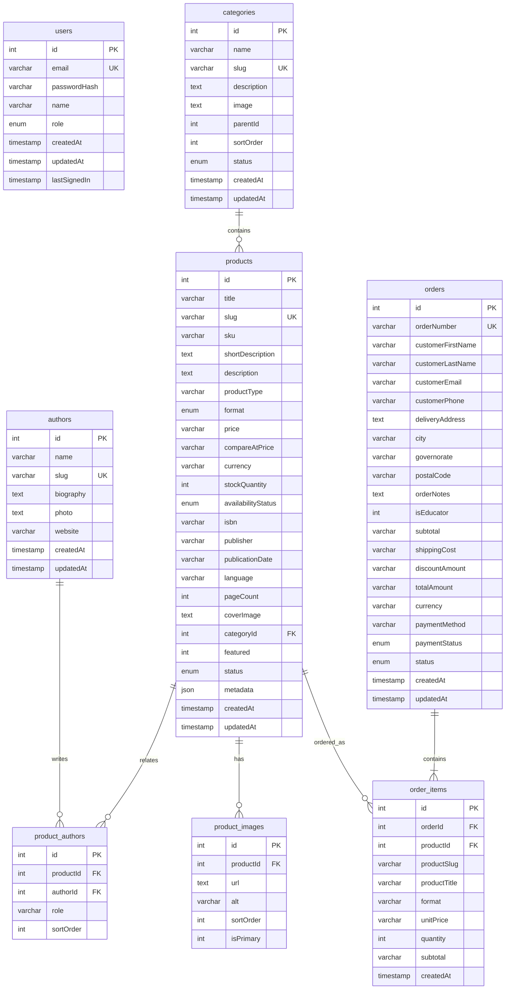

# LivresPro.tn — Database Specification & Schema

**Database Engine**: MySQL 8.0+  
**ORM**: Drizzle ORM (`drizzle-orm/mysql-core`)  
**Dialect**: MySQL  

---

## 1. Relational Entity Relationship Diagram

---

## 2. Table Specifications

### 2.1 `products`
* Stores all books and digital publications.
* `price`: Stored as a decimal string (e.g. `"65.00"`) to avoid floating-point inaccuracies.
* `format`: `PHYSICAL_BOOK`, `DIGITAL_BOOK`, `EBOOK`, `AUDIOBOOK`, `OTHER`.
* `availabilityStatus`: `in_stock`, `out_of_stock`, `preorder`.
* `status`: `draft` (hidden), `published` (storefront), `archived`.

### 2.2 `categories`
* Organizes catalog into distinct business sections (e.g., *Marketing & Marque*, *Management & Leadership*, *Stratégie & Innovation*).
* `slug`: URL-friendly identifier used for filtering on `/librairie`.

### 2.3 `authors` & `product_authors`
* Supports multiple co-authors per book (e.g., Philip Kotler, Waldemar Pfoertsch, Walid Kallel for *B2B Brand Management*).
* `role`: Describes contribution (*Auteur*, *Co-auteur*, *Préfacier*).

### 2.4 `orders` & `order_items`
* `orderNumber`: Human-readable reference number (e.g., `LP-2026-9481`).
* `paymentMethod`: Defaulted to `cash_on_delivery` (Paiement à la livraison).
* `status`: `new` $\rightarrow$ `confirmed` $\rightarrow$ `processing` $\rightarrow$ `shipped` $\rightarrow$ `delivered` $\rightarrow$ `cancelled`.
* `order_items`: Snapshots `productTitle`, `format`, and `unitPrice` at the time of purchase, preserving historical accuracy even if catalog prices change later.

### 2.5 `users`
* Administrative accounts with native authentication.
* Passwords stored as `salt:scryptDerivedKey` hashes.
